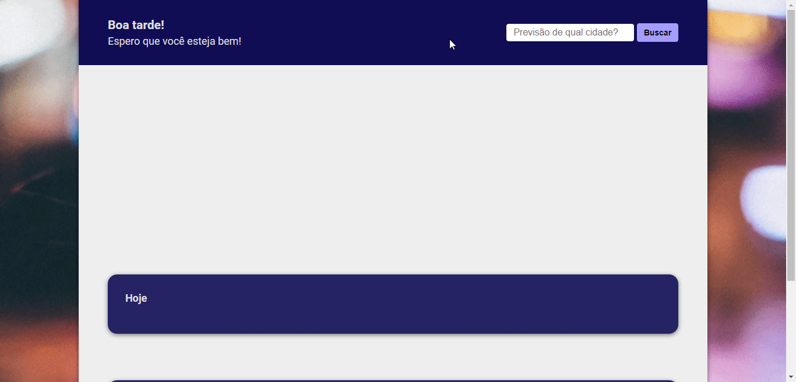

<h1 align="center">Weather App</h1>

A simple application that shows the weather of the city searched, consuming the <a href="https://www.accuweather.com/" targer="_blank">AccuWeather</a> <a href="https://developer.accuweather.com/" target="_blank">API</a>.

<a href="https://caiquegiovannini.github.io/weather-app/">Test Weather App here!</a>

[Under Development]

    

## :computer: Built With
- HTML5
- CSS3
- JavaScript

## :memo: License
This project is licensed under the MIT License - see the [LICENSE](LICENSE) file for details.

---

Made with :heart: by [Caique Giovannini](https://www.linkedin.com/in/caique-giovannini/)